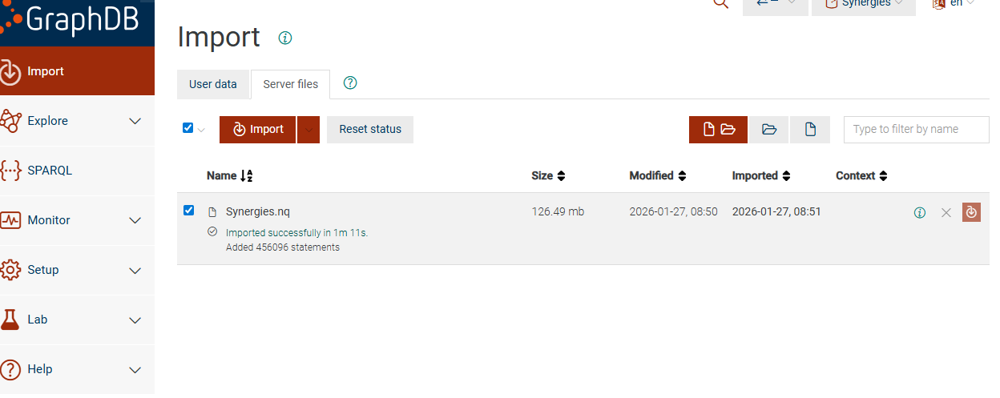
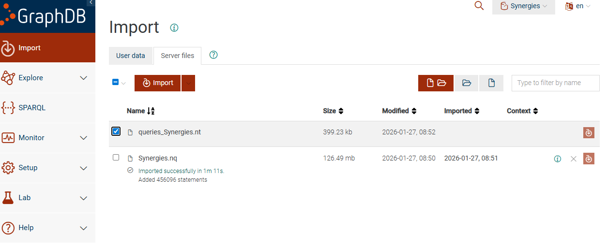

# Omegaprime-scenario-extraction - PIPELINE

This project runs a pipeline that:
1) starts GraphDB (via Docker),
2) creates the repository if needed,
3) imports the ontology,
4) converts VCD JSON files to RDF (Synergies.nq),
5) detects events/actions with SPARQL (queries_Synergies.nt),
6) optionally writes those actions/events back into VCD files.

## Configuration (conf.yaml)
Edit `conf.yaml` before running the pipeline if you need to change paths, ports, or repository names.

- `ontology`: base URI, prefix, and the ontology file path.
- `vcd.vcd_path`: input VCD folder (source JSON files).
- `paths.output_dir`: output folder for VCDs with actions/events.
- `database`: GraphDB connection (ip/port/repository).
- `endpoint_url`: full GraphDB SPARQL endpoint.
- `api`: optional class discovery API (used in preload).
- `thresholds`: numerical thresholds used for event/action detection.

## Run the pipeline
From the repository root, run:

```powershell
python .\run_pipeline.py
```

The script will:
1) start GraphDB (Docker) if needed,
2) create the repository if it does not exist,
3) import the ontology,
4) ask whether to run `preload.py` in multiprocessing or sequential mode,
5) run `preload.py` and generate `Synergies.nq`,
6) pause and ask you to import `Synergies.nq` manually,
7) run `queries.py` and generate `queries_Synergies.nt`,
8) pause and ask you to import `queries_Synergies.nt` manually,
9) ask if you want to export actions/events back to VCDs.

## Preload mode prompt
Before running `preload.py`, the script asks:
- **Multiprocessing (default)**: faster, but can fail on low RAM.
- **Sequential**: slower, but more stable.

## Manual imports in GraphDB

### Import `Synergies.nq`
When the console tells you to import `Synergies.nq`:
1) Open GraphDB Workbench.
2) Go to **Import -> Server Files**.
3) Select `Synergies.nq` and click **Import**.
4) Wait for the import to finish.



### Import `queries_Synergies.nt`
When the console tells you to import queries:
1) Open **Import -> Server Files** again.
2) Select **only** `queries_Synergies.nt`.
3) Do **not** select `Synergies.nq` at this step.
4) Click **Import** and wait for it to finish.



## Export actions/events back to VCDs
At the end, the pipeline asks:

```
Do you want to export actions/events back to VCDs? [y/N]
```

If you answer **yes**, it will create the output files in the folder from:
`conf.yaml -> paths.output_dir` (default: `./vcds_pruebas_con_acciones_y_eventos/`).

This will read the RDF in GraphDB and write the enriched VCDs into `paths.output_dir`.

## Re-run only part of the pipeline (examples)
You can skip steps if you only want to repeat a part:

- Re-run only `preload.py` (skip ontology + queries):
  ```powershell
  python .\run_pipeline.py --skip-ontology --skip-queries
  ```
- Re-run only `queries.py` (skip ontology + preload):
  ```powershell
  python .\run_pipeline.py --skip-ontology --skip-preload
  ```
- Run without starting Docker (GraphDB already running):
  ```powershell
  python .\run_pipeline.py --no-docker
  ```
- Only export VCDs (no pipeline, just write actions/events):
  ```powershell
  python .\graphdb_to_vcd_parser.py
  ```
